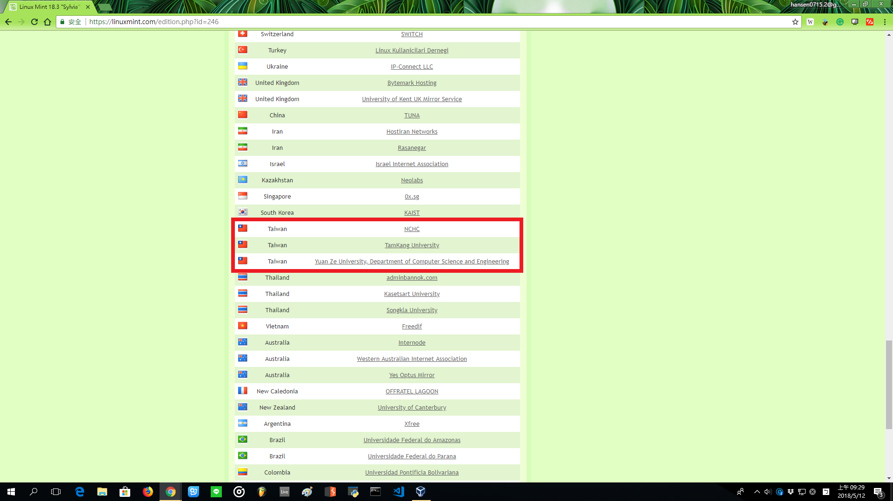

# 0.安裝虛擬機

這裡是我個人的一個小筆記

記錄我一些在學習程式的過程

我會在虛擬機的環境中做練習

並在主機中開發

這裡我們虛擬機軟體選擇的是VirtualBox

先進到官網



把那個大大的 Download 給他點下去

再來找到紅框這個按下去就能下載啦

開始安裝

之後就是一直下一步下一步

不用特別設定什麼

安裝完成

好的~

目前VirtualBox已經安裝完成了

接下來是要裝我虛擬機要用的 Linux Mint Sylvia 64-bit

先到他的官網

然後進到這個畫面

並選擇Download

這裡我選擇的是紅框那個



進到下載的畫面

往下拉找台服的會下載比較快哦~

下載完成

這是一個光碟映像檔

接下來回到VirtualBox

選擇新增

然後設定一下名稱和作業系統

這裡我稍微爬了個文

發現原來 Mint 是基於 Ubuntu 而開發出來的

那我在這邊就選擇 Ubuntu 64-bit

接下來就是一連串的下一步

全部都用預設值

除了 RAM

我發現 1024MB 好像有點卡

就把它設定到 2048MB 了

完成之後

現在要來改它的設定值

點選設定

找到存放位置 -&gt; IDE

右邊有個光碟的小圖示

點進去 -&gt; 選擇虛擬光碟檔案

找到剛剛存放iso檔的位置並選取

接下來到網路這邊

把附加到這個選項

改為橋接介面卡

以便使用現有網路環境

接下來就設定完成啦~

在紅框處點兩下開啟虛擬機

接著再安裝

就結束啦~

---更新---

我發現原先用的 Cinnamon 很吃顯卡

於是我換了 Mate

安裝方法一樣

